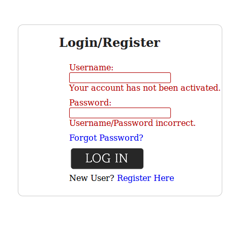
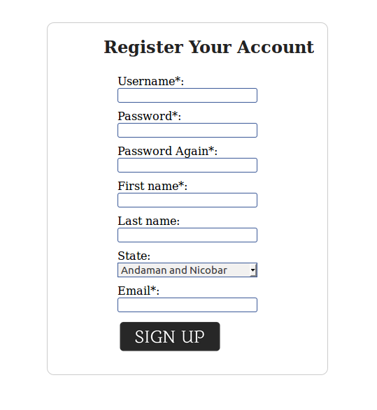
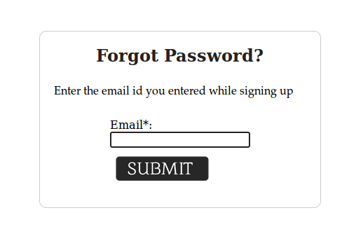

# PHP AUTHENTICATION
A simple, secure login and signup system with PHP and MySQL with user account verification and confirmation.

### Signup/Login Workflow
1. Create new user using register.php form (note: validation occurs both client and server side)
    Validation requires:
    * Passwords to match and be at least 6 characters
    * Valid email address
    * Unique username 
2. Password gets hashed
3. User gets added to database as unverified 
4. Email is sent to user email with verification link
5. User (or admin) clicks verification link which verifies user in the database
6. Verified user may now log in
7. Logged in user can change his/her password by using forgot1.php
8. Simple logout button in index.php to destroy user's session

### INSTALLATION             
#### Creating the MySQL Database                                      
~~~SQL
CREATE TABLE `users` (                                                          
`user_id` int(11) NOT NULL,                                                
`username` varchar(32) NOT NULL,                                           
`password` varchar(32) NOT NULL,                                             
`first_name` varchar(32) NOT NULL,                                             
`last_name` varchar(32) NOT NULL,                                              
`State` varchar(100) NOT NULL,                                       
`email` varchar(1024) NOT NULL,                                          
`email_code` varchar(32) NOT NULL,                                      
`active` int(11) NOT NULL DEFAULT '0'                                  
)    
~~~
### Setup core/connect.php, core/database/connect.php,                                                                             core/functions/connect.php, core/functions/users.php 
~~~php
<?php                                    
    //DATABASE CONNECTION VARIABLES                                 
    $servername = "localhost"; // Host name                 
    $username = "user"; // Mysql username                   
    $password = "password"; // Mysql password                     
    $dbname = "users"; // Database name  
~~~    
    
### Setup php to be able to send mail using sendmail or postfix
